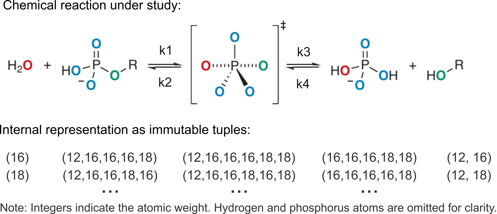
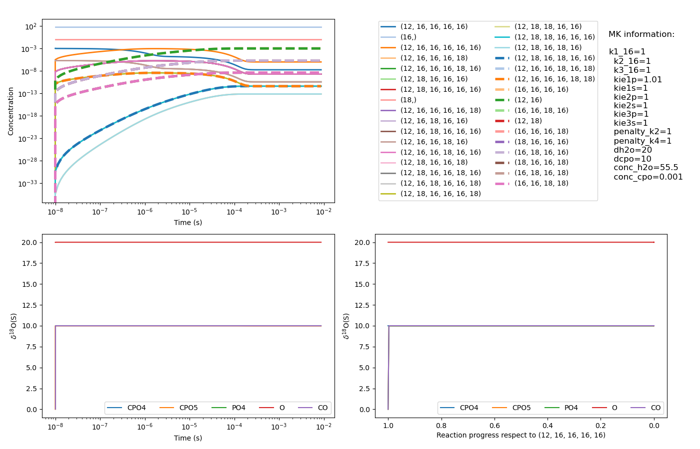

# Toy Model for Oxygen Isotope Fractionation

> *A simplified kinetic model (i.e. toy model) for phosphoryl-transfer reactions of the different oxygen isotopologues and isotopomers of the four species.*

## 1. Description

The toy model code was developed to evaluate the oxygen isotope fractionation in all experimentally 
accessible chemical species, namely 2-naphthyl phosphate, water, 2-naphthol and phosphate.
Figure below shows the general form of the reaction studied, the data objects used to model the five 
species, and the reaction constants for each direction.
The user can introduce the isotopic effect as primary and secondary in the `config.yaml` file.
See full article in [Bernet et al. 2026](https://chemrxiv.org/).


*(output example)*

## Installation

```bash
# (recommended) Create a dedicated environment
python3 -m venv env4toymodel
cd env4toymodel
source bin/activate

# Clone and install
git clone https://github.com/petrusen/toymodel.git
cd toymodel
python3 -m pip install -e .  # dependencies already defined in setup.py
```

## Example

```bash
# Introduce input parameters
vi config.yaml  # or the text editor of your choice

# Run kinetic simulation
python3 -m toymodel
```

Running the toymodel will produce by default a four panel plot:


*(output example)*

## Support

Should you find any problem or bug, please write a message to
[enric.petrus@eawag.ch](mailto:enric.petrus@eawag.ch) or open a new issue.
